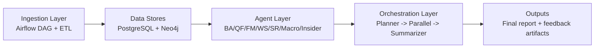
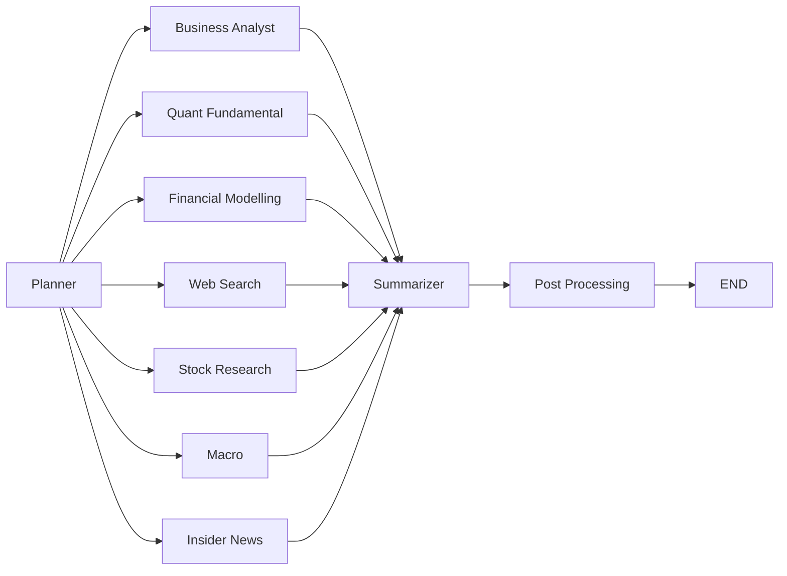

# The Agentic Investment Analyst (AIPM)

An end-to-end multi-agent equity research platform that combines deterministic financial computation, retrieval-backed qualitative analysis, and real-time web intelligence. 

## Key Design Principles
This project addresses the limitations of standard generative AI assistants in the financial domain through five key design principles:
1. **Division of Labour:** Specific tasks are assigned to specialised agents matched to the type of reasoning required.
2. **Deterministic Computation:** Numerical outputs are calculated programmatically rather than generated by a language model.
3. **Evidence Grounding:** Qualitative statements must reference retrieved source material through systematic citation.
4. **Transparency:** The analytical process is visible through parallel execution, progress tracking, and structured output.
5. **Feedback Integration:** The system uses Reinforcement Learning from AI Feedback (RLAIF) and user feedback via Episodic Memory to learn from past successes and failures.

## System Overview

The platform runs as a 3-layer architecture:

```text
Ingestion (Airflow) -> Agents (specialized analysis) -> Orchestration (planning + synthesis)
```

1. **Data Layer:** A dual-database architecture. **PostgreSQL** (with pgvector) serves as the primary structured data store (market data, financials, ratios, sentiment) and vector store for semantic retrieval. **Neo4j** serves as the graph database for company nodes, document chunks, and relationship traversals. 
2. **AI Agent Layer:** Seven specialised sub-agents deployed in a parallel execution tier.
3. **Orchestration Layer:** A LangGraph-based workflow that manages state, ReAct retry logic, parallel agent execution, and result synthesis.



## Current Orchestrated Agents

1. **Business Analyst (Graph RAG)** - Retrieves evidence from Neo4j related to company moat and strategy. Uses Corrective RAG (CRAG) to rewrite queries or fallback to web search if confidence is low.
2. **Quant Fundamental (Non-RAG)** - Computes deterministic factor models (Value, Quality, Momentum/Risk) via Python, using LLMs only for narrative interpretation.
3. **Financial Modelling (Non-RAG)** - Executes DCF models, WACC sensitivity, and comparable company analysis. Deploys a Mixture-of-Experts (MoE) consensus (Optimist, Realist, Pessimist) for price targets.
4. **Web Search (Perplexity RAG)** - Gathers real-time intelligence via the Perplexity API for breaking news and unknown risk signals.
5. **Stock Research (Non-RAG)** - Computes NLP signal features on earnings calls and analyzes broker consensus. 
6. **Macro (Non-RAG)** - Analyzes broader economic indicators from Bloomberg macro reports to identify market regimes and top macro themes.
7. **Insider News (Non-RAG)** - Reviews insider transaction patterns, conviction strength, and news sentiment trends.

## Quick Start

```bash
python3.11 -m venv .venv
source .venv/bin/activate
pip install -r requirements.txt

docker compose up -d --build
```

Optional health check after services start:

```bash
docker exec fyp-airflow-webserver python /opt/airflow/ingestion/etl/inspect_db.py
```

Run orchestration from Python:

```bash
python - <<'PY'
from orchestration.graph import run

result = run("What is Apple's competitive moat and current valuation?")
print(result["final_summary"])
PY
```

Run Streamlit UI:

```bash
streamlit run ui/app.py
```

## Local Endpoints

- Airflow UI: `http://localhost:8080`
- Neo4j Browser: `http://localhost:7474`
- PostgreSQL: `localhost:5432`
- Ollama API: `http://localhost:11434`
- Streamlit: `http://localhost:8501`

## Deployment & Hosting

### Option 1: Cloud Deployment (AWS, GCP, DigitalOcean)

For a robust, permanent deployment, host the platform on a cloud Virtual Machine (VM).
- **Requirements:** Linux VM (Ubuntu 22.04+), 4-8 vCPUs, 16GB RAM, 50GB SSD.
- **Network:** Open ports 8501 (Streamlit), 8080 (Airflow), and 7474 (Neo4j).

1. Clone the repository to the VM.
2. Create a `.env` file with `EODHD_API_KEY`, `DEEPSEEK_API_KEY`, `POSTGRES_*`, and `NEO4J_*` credentials.
3. Run `docker compose up -d --build`.
4. Access via `http://<your-vm-public-ip>:8501`.

*Alternatively, you can host just the frontend on [Streamlit Cloud](https://share.streamlit.io), but you must use externally hosted PostgreSQL and Neo4j databases.*

### Option 2: Local Tunneling with ngrok (Quick Sharing)

If you want to share your app running on your personal machine *without* deploying it to the cloud, use ngrok.

**Prerequisites:**
1. **ngrok account** - Sign up at https://dashboard.ngrok.com
2. **Docker & Docker Compose** installed
3. **ngrok auth token** from your dashboard

**Quick Start Script:**
```bash
# Navigate to your project directory
cd /Users/brianho/FYP

# Run the startup script with your ngrok token
./start_with_ngrok.sh YOUR_NGROK_AUTH_TOKEN
```

The script will:
- Start PostgreSQL and Neo4j
- Start ngrok tunnel on port 8501
- Start Streamlit app
- Display your public URL (or check `http://localhost:4040`)

*For full deployment details and troubleshooting, see **[docs/DEPLOYMENT.md](docs/DEPLOYMENT.md)**.*

## Core Runtime Flow

Current orchestration graph:

```text
planner -> enabled agents (parallel) -> summarizer -> post_processing -> END
```

- Planner resolves tickers, complexity, and active agents.
- Agent branches run in LangGraph native parallel fan-out.
- Summarizer builds a unified report with references.
- Post-processing handles scoring and episodic memory persistence.



See `orchestration/README.md` for graph-level details.

## Common Agent Commands

```bash
# Business Analyst
python -m agents.business_analyst.agent --ticker AAPL --task "What is Apple's moat?"

# Quant Fundamental
python -m agents.quant_fundamental.agent --ticker NVDA

# Financial Modelling
python -m agents.financial_modelling.agent --ticker TSLA
```

Programmatic wrappers:

```bash
python - <<'PY'
from agents.web_search.agent import run_web_search_agent
from agents.macro_agent.agent import run_full_analysis as run_macro
from agents.insider_news_agent.agent import run_full_analysis as run_insider

print(run_web_search_agent({"query": "NVDA regulatory risk", "ticker": "NVDA"}))
print(run_macro("AAPL"))
print(run_insider("AAPL"))
PY
```

## Ingestion

- DAG: `ingestion/dags/dag_eodhd_ingestion_unified.py`
- ETL scripts: `ingestion/etl/`
- Output stores: PostgreSQL + Neo4j

See `ingestion/README.md` and `ingestion/dags/README_eodhd_dag.md`.

## Key Environment Variables

Core:

- `EODHD_API_KEY`
- `DEEPSEEK_API_KEY`
- `POSTGRES_HOST`, `POSTGRES_PORT`, `POSTGRES_DB`, `POSTGRES_USER`, `POSTGRES_PASSWORD`
- `NEO4J_URI`, `NEO4J_USER`, `NEO4J_PASSWORD`
- `OLLAMA_BASE_URL`
- `TRACKED_TICKERS`

Model-related:

- `ORCHESTRATION_PLANNER_MODEL` (default `deepseek-chat`)
- `ORCHESTRATION_SUMMARIZER_MODEL` (default `deepseek-v4-pro`)
- `LLM_MODEL_QUANT_FUNDAMENTAL`
- `LLM_MODEL_FINANCIAL_MODELING`

## Testing

```bash
pytest tests/ -v
pytest tests/integration/ -v -m integration
pytest tests/prompts/ -v -m prompt
```

See `tests/README.md` for markers, dependencies, and execution patterns.
The project includes a 141-test suite (79 prompt tests, 62 integration tests) demonstrating a 100% pass rate across logic validation, factual grounding, database connectivity, and RLAIF feedback loop closure.

## Declaration of Contribution

This project was developed collaboratively:
- **Brian:** Data Layer (PostgreSQL + Neo4j design), Ingestion Pipeline (Airflow DAG + ETL), Orchestration Layer (LangGraph workflow, Planner, Summariser, Post-Processing), and Streamlit UI (Interactive Charts, ngrok access).
- **Ivan:** AI Agent Layer (all seven specialist agents: Business Analyst, Quant Fundamental, Financial Modelling, Web Search, Stock Research, Macro, Insider News), Critic Agent (offline), Integration Testing Framework, Docker Containerisation.

## Docs Governance

- Docs index: `docs/README.md`
- Last docs refresh: 2026-04-08
- Validation checklist used in this refresh:
  - Commands match current CLI/parser signatures
  - Agent count and routing match `orchestration/graph.py`
  - Env var names match active config modules
  - Legacy backend references removed or explicitly marked historical
