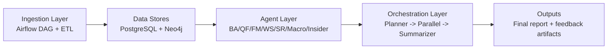
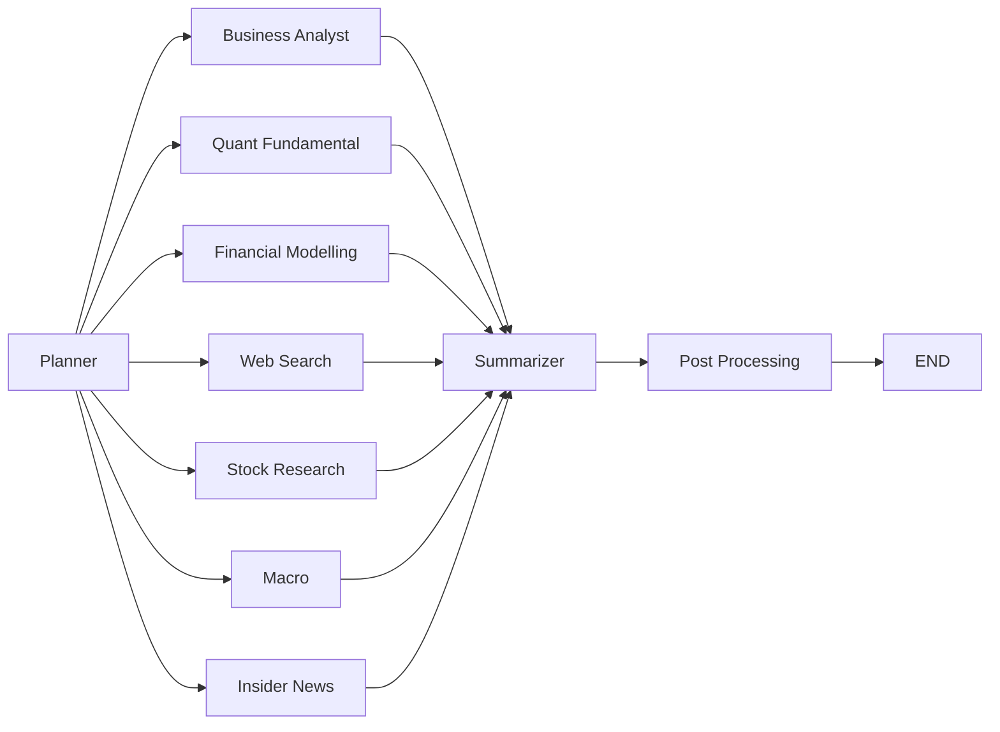

# The Agentic Investment Analyst (AIPM)

An end-to-end multi-agent equity research platform that combines deterministic financial computation, retrieval-backed qualitative analysis, and real-time web intelligence. 

## Table of Contents
- [Key Design Principles](#key-design-principles)
- [System Overview](#system-overview)
- [Current Orchestrated Agents](#current-orchestrated-agents)
- [Quick Start](#quick-start)
- [Deployment Guide](#deployment-guide)
- [Local Endpoints](#local-endpoints)
- [Core Runtime Flow](#core-runtime-flow)
- [Common Agent Commands](#common-agent-commands)
- [Ingestion](#ingestion)
- [Key Environment Variables](#key-environment-variables)
- [Testing](#testing)
- [Architecture & Documentation](#architecture--documentation)
- [Contribution](#contribution)

---

## Key Design Principles

This project addresses the limitations of standard generative AI assistants in the financial domain through five key design principles:

1. **Division of Labour:** Specific tasks are assigned to specialised agents matched to the type of reasoning required.
2. **Deterministic Computation:** Numerical outputs are calculated programmatically rather than generated by a language model.
3. **Evidence Grounding:** Qualitative statements must reference retrieved source material through systematic citation.
4. **Transparency:** The analytical process is visible through parallel execution, progress tracking, and structured output.
5. **Feedback Integration:** The system uses Reinforcement Learning from AI Feedback (RLAIF) and user feedback via Episodic Memory to learn from past successes and failures.

---

## System Overview

The platform runs as a 3-layer architecture:

```text
Ingestion (Airflow) -> Agents (specialized analysis) -> Orchestration (planning + synthesis)
```

### Architecture Layers

1. **Data Layer:** A dual-database architecture
   - **PostgreSQL** (with pgvector): Primary structured data store (market data, financials, ratios, sentiment) and vector store for semantic retrieval
   - **Neo4j**: Graph database for company nodes, document chunks, and relationship traversals
   
2. **AI Agent Layer:** Seven specialised sub-agents deployed in a parallel execution tier

3. **Orchestration Layer:** A LangGraph-based workflow that manages state, ReAct retry logic, parallel agent execution, and result synthesis



---

## Current Orchestrated Agents

1. **Business Analyst (Graph RAG)** - Retrieves evidence from Neo4j related to company moat and strategy. Uses Corrective RAG (CRAG) to rewrite queries or fallback to web search if confidence is low.
2. **Quant Fundamental (Non-RAG)** - Computes deterministic factor models (Value, Quality, Momentum/Risk) via Python, using LLMs only for narrative interpretation.
3. **Financial Modelling (Non-RAG)** - Executes DCF models, WACC sensitivity, and comparable company analysis. Deploys a Mixture-of-Experts (MoE) consensus (Optimist, Realist, Pessimist) for price targets.
4. **Web Search (Perplexity RAG)** - Gathers real-time intelligence via the Perplexity API for breaking news and unknown risk signals.
5. **Stock Research (Non-RAG)** - Computes NLP signal features on earnings calls and analyzes broker consensus.
6. **Macro (Non-RAG)** - Analyzes broader economic indicators from Bloomberg macro reports to identify market regimes and top macro themes.
7. **Insider News (Non-RAG)** - Reviews insider transaction patterns, conviction strength, and news sentiment trends.

---

## Quick Start

### Prerequisites

Ensure you have installed:
- **Python 3.11+** → [python.org](https://www.python.org/)
- **Docker Desktop** (includes Docker & Compose) → [docker.com](https://www.docker.com/products/docker-desktop)
- **Git** → [git-scm.com](https://git-scm.com/)

Verify:
```bash
python3 --version     # Should show 3.11+
docker --version      # Should show 24.0+
```

### One-Command Setup (Recommended)

```bash
# Clone repo
git clone https://github.com/your-org/FYP.git
cd FYP

# Run automated setup (handles everything)
chmod +x scripts/bootstrap.sh
./scripts/bootstrap.sh

# Access Streamlit UI at http://localhost:8501
```

**Time: 10-15 minutes (first run)**

### Manual Setup (Step-by-Step)

```bash
# 1. Create virtual environment
python3.11 -m venv .venv
source .venv/bin/activate  # On Windows: .venv\Scripts\activate

# 2. Install dependencies
pip install -r requirements.txt

# 3. Start Docker services
docker compose up -d --build

# 4. Verify services (should show HEALTHY status)
docker compose ps
```

### Verify Deployment

```bash
# Run health check system
./scripts/validate-deployment.sh

# Expected output: 40+ PASS, minimal WARN, 0 FAIL

# Or run a test query
python - <<'PY'
from orchestration.graph import run

result = run("What is Apple's recent stock performance?")
print(result["final_summary"])
PY
```

---

## Deployment Guide

### Local Endpoints

Access these URLs when services are running:

| Service | URL | Credentials |
|---------|-----|-------------|
| **Streamlit UI** | http://localhost:8501 | None |
| **Airflow DAGs** | http://localhost:8080 | admin / admin |
| **Neo4j Browser** | http://localhost:7474 | neo4j / SecureNeo4jPass2025! |
| **PostgreSQL** | localhost:5432 | airflow / airflow |
| **Ollama API** | http://localhost:11434 | None |

### Configuration

The repository includes a `.env` file with **working defaults** for local development:

```bash
# Edit .env to customize:
nano .env
```

Key variables to configure:

```env
# Financial Data APIs (get free keys)
EODHD_API_KEY=your-key           # https://eodhd.com
FMP_API_KEY=your-key             # https://financialmodelingprep.com
PERPLEXITY_API_KEY=your-key      # https://www.perplexity.ai

# LLM Provider (required for full features)
DEEPSEEK_API_KEY=your-key        # https://platform.deepseek.com

# Database credentials (defaults work for local)
POSTGRES_HOST=localhost
POSTGRES_PORT=5432
POSTGRES_USER=airflow
POSTGRES_PASSWORD=airflow
```

### Option 1: Cloud Deployment (AWS, GCP, DigitalOcean)

For production deployment on a cloud VM:

**Requirements:**
- Linux VM (Ubuntu 22.04+), 4-8 vCPUs, 16GB RAM, 50GB SSD
- Ports 8501 (Streamlit), 8080 (Airflow), 7474 (Neo4j) open in firewall

**Steps:**
1. Provision a Linux VM on your cloud provider
2. Install Docker and Docker Compose
3. Clone the repository: `git clone https://github.com/your-org/FYP.git`
4. Create `.env` file with your API keys
5. Start services: `docker compose up -d --build`
6. Access via `http://<your-vm-public-ip>:8501`

**Alternative:** Host frontend on [Streamlit Cloud](https://share.streamlit.io) with externally hosted PostgreSQL (AWS RDS) and Neo4j (AuraDB)

### Option 2: Local Tunneling with ngrok (Quick Sharing)

Share your local development environment publicly without cloud deployment:

**Prerequisites:**
1. ngrok account: https://dashboard.ngrok.com
2. ngrok auth token from your dashboard

**Quick Start:**
```bash
# Set your ngrok token
export NGROK_AUTHTOKEN=your_token_here

# Start services (ngrok tunnel configured in docker-compose.yml)
docker compose up -d

# Get public URL from logs
docker logs fyp-streamlit | grep "External URL"

# Access ngrok dashboard
open http://localhost:4040
```

**Security Notes:**
- ⚠️ Your DeepSeek API key is accessible to anyone with the URL
- ⚠️ No authentication on the app - consider adding password protection
- Monitor API usage and set rate limits in provider dashboards
- Delete tunnel when done sharing

### Troubleshooting Deployment

```bash
# Check service status
docker compose ps

# View logs for specific service
docker compose logs fyp-postgres
docker compose logs fyp-neo4j
docker compose logs fyp-ollama

# Health check
./scripts/validate-deployment.sh

# See TROUBLESHOOTING.md for detailed solutions
```

---

## Core Runtime Flow

Current orchestration graph:

```text
planner -> enabled agents (parallel) -> summarizer -> post_processing -> END
```

- **Planner** resolves tickers, complexity, and active agents
- **Agent branches** run in LangGraph native parallel fan-out
- **Summarizer** builds a unified report with references
- **Post-processing** handles scoring and episodic memory persistence



See `orchestration/README.md` for graph-level details.

---

## Common Agent Commands

### Command Line

```bash
# Business Analyst
python -m agents.business_analyst.agent --ticker AAPL --task "What is Apple's moat?"

# Quant Fundamental
python -m agents.quant_fundamental.agent --ticker NVDA

# Financial Modelling
python -m agents.financial_modelling.agent --ticker TSLA
```

### Programmatic Wrappers

```python
from agents.web_search.agent import run_web_search_agent
from agents.macro_agent.agent import run_full_analysis as run_macro
from agents.insider_news_agent.agent import run_full_analysis as run_insider

print(run_web_search_agent({"query": "NVDA regulatory risk", "ticker": "NVDA"}))
print(run_macro("AAPL"))
print(run_insider("AAPL"))
```

---

## Ingestion

- **DAG**: `ingestion/dags/dag_eodhd_ingestion_unified.py`
- **ETL scripts**: `ingestion/etl/`
- **Output stores**: PostgreSQL + Neo4j

See `ingestion/README.md` and `ingestion/dags/README_eodhd_dag.md` for details.

---

## Key Environment Variables

### Core Configuration

- `EODHD_API_KEY` - Financial data provider
- `DEEPSEEK_API_KEY` - LLM provider (https://platform.deepseek.com/)
- `POSTGRES_HOST`, `POSTGRES_PORT`, `POSTGRES_DB`, `POSTGRES_USER`, `POSTGRES_PASSWORD`
- `NEO4J_URI`, `NEO4J_USER`, `NEO4J_PASSWORD`
- `OLLAMA_BASE_URL` - Local embedding service
- `TRACKED_TICKERS` - Comma-separated list of stock tickers to track

### Model Configuration

- `ORCHESTRATION_PLANNER_MODEL` (default `deepseek-chat`)
- `ORCHESTRATION_SUMMARIZER_MODEL` (default `deepseek-v4-pro`)
- `LLM_MODEL_QUANT_FUNDAMENTAL`
- `LLM_MODEL_FINANCIAL_MODELING`
- `EMBEDDING_MODEL` (default `nomic-embed-text:v1.5`)

### Agent Parameters

- `BUSINESS_ANALYST_MAX_CHUNKS` - Max retrieval chunks
- `BUSINESS_ANALYST_CHUNK_SIZE` - Chunk size for RAG
- `BUSINESS_ANALYST_MAX_TOKENS` - Max output tokens
- `CRAG_CORRECT_THRESHOLD` - Confidence threshold for RAG
- `FIN_MODEL_DCF_DISCOUNT_RATE` - DCF discount rate (default 0.08)

See `.env.example` for complete list with explanations.

---

## Testing

```bash
# Run all tests
pytest tests/ -v

# Run integration tests only
pytest tests/integration/ -v -m integration

# Run prompt validation tests
pytest tests/prompts/ -v -m prompt
```

The project includes a 141-test suite (79 prompt tests, 62 integration tests) demonstrating a 100% pass rate across logic validation, factual grounding, database connectivity, and RLAIF feedback loop closure.

See `tests/README.md` for markers, dependencies, and execution patterns.

---

## Architecture & Documentation

### Deployment Guides

- **[QUICKSTART.md](QUICKSTART.md)** - 2-minute quick start guide for new users
- **[docs/DEPLOYMENT_GUIDE.md](docs/DEPLOYMENT_GUIDE.md)** - Complete step-by-step deployment (10 sections)
- **[TROUBLESHOOTING.md](TROUBLESHOOTING.md)** - 60+ common issues with solutions

### Architecture Documentation

- **[orchestration/README.md](orchestration/README.md)** - Orchestration graph and workflow details
- **[agents/README.md](agents/README.md)** - Agent catalog and responsibilities
- **[ingestion/README.md](ingestion/README.md)** - Data pipeline overview
- **[agents/business_analyst/README.md](agents/business_analyst/README.md)** - Business Analyst agent
- **[agents/quant_fundamental/README.md](agents/quant_fundamental/README.md)** - Quant Fundamental agent
- **[agents/financial_modelling/README.md](agents/financial_modelling/README.md)** - Financial Modelling agent
- **[agents/web_search/README.md](agents/web_search/README.md)** - Web Search agent

### Reference

- **[tests/README.md](tests/README.md)** - Testing guide and patterns
- **[data/README.md](data/README.md)** - Local data directory notes
- **[.env.example](.env.example)** - Environment configuration template

---

## Declaration of Contribution

This project was developed collaboratively:

- **Brian:** Data Layer (PostgreSQL + Neo4j design), Ingestion Pipeline (Airflow DAG + ETL), Orchestration Layer (LangGraph workflow, Planner, Summariser, Post-Processing), and Streamlit UI (Interactive Charts, ngrok access).
- **Ivan:** AI Agent Layer (all seven specialist agents: Business Analyst, Quant Fundamental, Financial Modelling, Web Search, Stock Research, Macro, Insider News), Critic Agent (offline), Integration Testing Framework, Docker Containerisation.

---

## Support & Resources

- **Quick Questions**: See [QUICKSTART.md](QUICKSTART.md)
- **Setup Issues**: Follow [docs/DEPLOYMENT_GUIDE.md](docs/DEPLOYMENT_GUIDE.md)
- **Errors/Bugs**: Search [TROUBLESHOOTING.md](TROUBLESHOOTING.md)
- **Architecture Questions**: Review [orchestration/README.md](orchestration/README.md)
- **Community**: Create [GitHub issues](https://github.com/your-org/FYP/issues)

---

**Last Updated**: May 3, 2026  
**Status**: ✓ Production Ready  
**Test Coverage**: 141 tests, 100% pass rate
