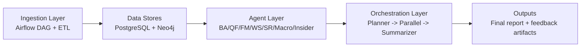
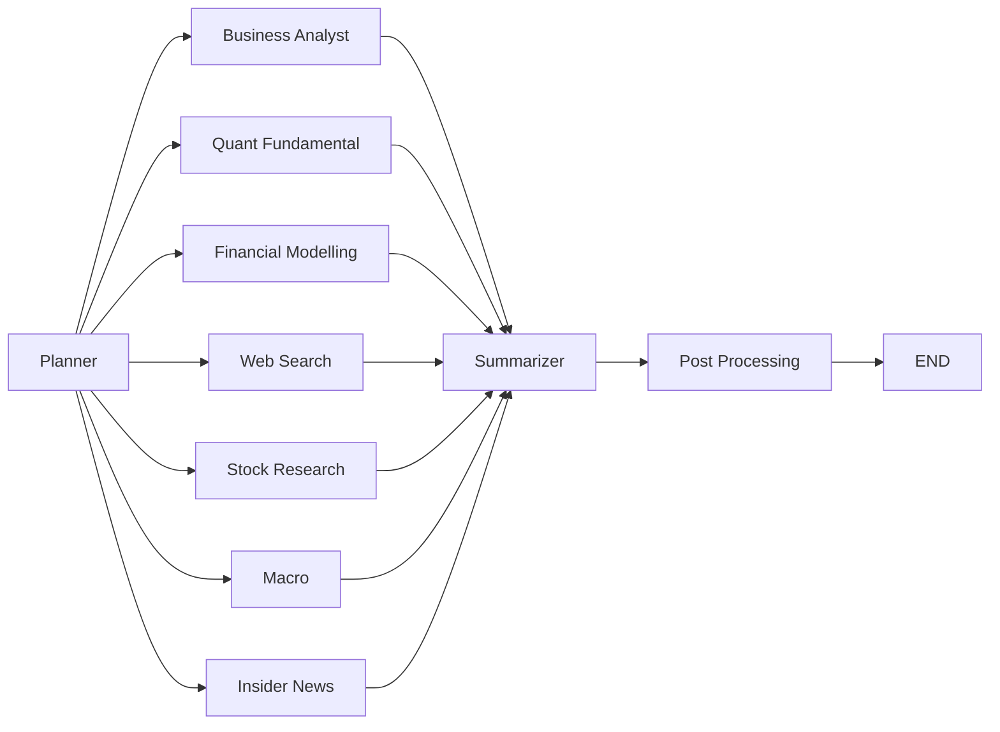

# The Agentic Investment Analyst

An end-to-end multi-agent equity research platform that combines deterministic financial computation, retrieval-backed qualitative analysis, and real-time web intelligence.

## System Overview

The platform runs as a 3-layer pipeline:

```text
Ingestion (Airflow) -> Agents (specialized analysis) -> Orchestration (planning + synthesis)
```

- Ingestion populates PostgreSQL and Neo4j from scheduled ETL tasks.
- Agents produce domain-specific outputs (qualitative, quant, valuation, web, macro, insider).
- Orchestration routes, runs in parallel, merges outputs, and writes final report artifacts.



## Current Orchestrated Agents

1. Business Analyst - `agents/business_analyst/`
2. Quant Fundamental - `agents/quant_fundamental/`
3. Financial Modelling - `agents/financial_modelling/`
4. Web Search - `agents/web_search/`
5. Stock Research - `agents/stock_research_agent/`
6. Macro - `agents/macro_agent/`
7. Insider News - `agents/insider_news_agent/`

## Quick Start

```bash
python3.11 -m venv .venv
source .venv/bin/activate
pip install -r requirements.txt

docker compose up -d --build
```

Optional health check after services start:

```bash
docker exec fyp-airflow-webserver python /opt/airflow/ingestion/etl/inspect_db.py
```

Run orchestration from Python:

```bash
python - <<'PY'
from orchestration.graph import run

result = run("What is Apple's competitive moat and current valuation?")
print(result["final_summary"])
PY
```

Run Streamlit UI:

```bash
streamlit run POC/streamlit/app.py
```

## Local Endpoints

- Airflow UI: `http://localhost:8080`
- Neo4j Browser: `http://localhost:7474`
- PostgreSQL: `localhost:5432`
- Ollama API: `http://localhost:11434`
- Streamlit: `http://localhost:8501`

## Core Runtime Flow

Current orchestration graph:

```text
planner -> enabled agents (parallel) -> summarizer -> post_processing -> END
```

- Planner resolves tickers, complexity, and active agents.
- Agent branches run in LangGraph native parallel fan-out.
- Summarizer builds a unified report with references.
- Post-processing handles scoring and episodic memory persistence.



See `orchestration/README.md` for graph-level details.

## Common Agent Commands

```bash
# Business Analyst
python -m agents.business_analyst.agent --ticker AAPL --task "What is Apple's moat?"

# Quant Fundamental
python -m agents.quant_fundamental.agent --ticker NVDA

# Financial Modelling
python -m agents.financial_modelling.agent --ticker TSLA
```

Programmatic wrappers:

```bash
python - <<'PY'
from agents.web_search.agent import run_web_search_agent
from agents.macro_agent.agent import run_full_analysis as run_macro
from agents.insider_news_agent.agent import run_full_analysis as run_insider

print(run_web_search_agent({"query": "NVDA regulatory risk", "ticker": "NVDA"}))
print(run_macro("AAPL"))
print(run_insider("AAPL"))
PY
```

## Ingestion

- DAG: `ingestion/dags/dag_eodhd_ingestion_unified.py`
- ETL scripts: `ingestion/etl/`
- Output stores: PostgreSQL + Neo4j

See `ingestion/README.md` and `ingestion/dags/README_eodhd_dag.md`.

## Key Environment Variables

Core:

- `EODHD_API_KEY`
- `DEEPSEEK_API_KEY`
- `POSTGRES_HOST`, `POSTGRES_PORT`, `POSTGRES_DB`, `POSTGRES_USER`, `POSTGRES_PASSWORD`
- `NEO4J_URI`, `NEO4J_USER`, `NEO4J_PASSWORD`
- `OLLAMA_BASE_URL`
- `TRACKED_TICKERS`

Model-related:

- `ORCHESTRATION_PLANNER_MODEL` (default `deepseek-chat`)
- `ORCHESTRATION_SUMMARIZER_MODEL` (default `deepseek-reasoner`)
- `LLM_MODEL_QUANT_FUNDAMENTAL`
- `LLM_MODEL_FINANCIAL_MODELING`

## Testing

```bash
pytest tests/ -v
pytest tests/integration/ -v -m integration
pytest tests/prompts/ -v -m prompt
```

See `tests/README.md` for markers, dependencies, and execution patterns.

## Docs Governance

- Docs index: `docs/README.md`
- Last docs refresh: 2026-04-08
- Validation checklist used in this refresh:
  - Commands match current CLI/parser signatures
  - Agent count and routing match `orchestration/graph.py`
  - Env var names match active config modules
  - Legacy backend references removed or explicitly marked historical
