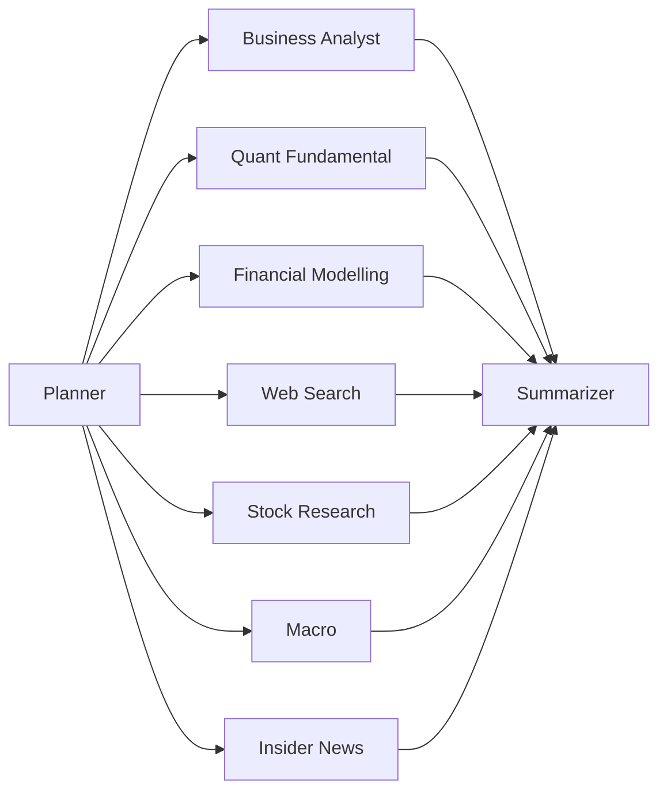

# Agents Layer

`agents/` contains the domain agents used by the orchestration graph.

## Current Agent Set

| Agent | Path | Main Role | Entry Point |
|---|---|---|---|
| Business Analyst | `agents/business_analyst/` | Qualitative analysis from local text + graph + sentiment | `python -m agents.business_analyst.agent` |
| Quant Fundamental | `agents/quant_fundamental/` | Deterministic factor math from PostgreSQL | `python -m agents.quant_fundamental.agent` |
| Financial Modelling | `agents/financial_modelling/` | DCF/comps/technicals/factor outputs | `python -m agents.financial_modelling.agent` |
| Web Search | `agents/web_search/` | Real-time web updates and risk signals | `run_web_search_agent()` / `web_search_node()` |
| Stock Research | `agents/stock_research_agent/` | Earnings call + broker report synthesis | `run_full_analysis()` |
| Macro | `agents/macro_agent/` | Macro regime and transmission-to-ticker analysis | `run_full_analysis()` |
| Insider News | `agents/insider_news_agent/` | Insider transactions + news synthesis | `run_full_analysis()` |

## How Orchestration Uses Them

- Planner resolves ticker(s), complexity, and enabled agents.
- Enabled agents run in parallel branches.
- Each branch has per-agent retry routing based on output + retry budget.
- Summarizer merges outputs into final report.



See `orchestration/README.md` for full graph details.

## Quick Commands

```bash
# Business Analyst
python -m agents.business_analyst.agent --ticker AAPL --task "What is Apple's moat?"

# Quant Fundamental
python -m agents.quant_fundamental.agent --ticker AAPL

# Financial Modelling
python -m agents.financial_modelling.agent --ticker AAPL
```

Web Search, Macro, Insider News, and Stock Research are typically called through orchestration, but can be invoked programmatically from their `agent.py` wrappers.

## Shared Infrastructure

- PostgreSQL: structured tables + vectorized text tables.
- Neo4j: graph entities and chunk retrieval.
- DeepSeek API: planner/summarizer and several agent LLM calls.
- Ollama: embeddings and selected local model fallback paths.

## Documentation Metadata

- Last updated: 2026-04-08
- Source of truth for branch routing: `orchestration/graph.py`
