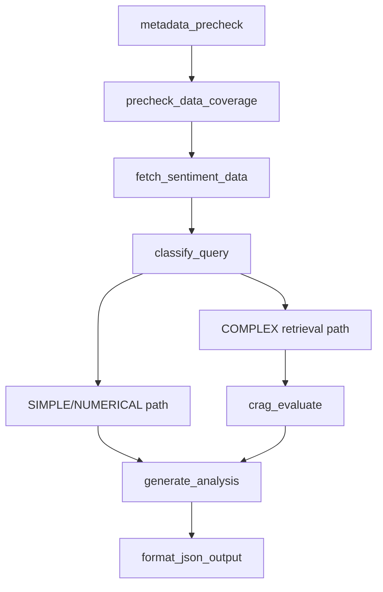

# Business Analyst Agent

Qualitative analysis agent that combines structured sentiment/context data with chunk retrieval and CRAG-style routing.

## Role

- Answers qualitative company questions (moat, risks, strategy, guidance narrative).
- Pulls sentiment/company context from PostgreSQL + Neo4j.
- Retrieves textual evidence chunks and returns structured JSON.
- Uses DeepSeek for generation; embeddings/retrieval infrastructure remains local.

## Execution Flow (High Level)

`metadata_precheck -> precheck_data_coverage -> fetch_sentiment_data -> classify_query -> retrieval path -> generate_analysis -> format_json_output`

Routing behavior:

- `SIMPLE` and `NUMERICAL` paths: fast retrieval path, bypasses CRAG grading.
- `COMPLEX` path: multi-stage retrieval + CRAG evaluation + optional rewrite loop.



## CLI Usage

```bash
python -m agents.business_analyst.agent --ticker AAPL --task "What is Apple's competitive moat?"
python -m agents.business_analyst.agent --ticker TSLA --task "What are Tesla's key risks?" --verbose
python -m agents.business_analyst.agent --ticker AAPL --task "Summarize moat drivers" --validate-citations
```

Available CLI flags (from parser):

- `--ticker`
- `--task`
- `--pretty`
- `--log-level`
- `--verbose`
- `--validate-citations`

## Programmatic API

```python
from agents.business_analyst.agent import run, run_full_analysis

single = run(task="What is Apple's moat?", ticker="AAPL")
full = run_full_analysis(ticker="AAPL")
```

## Key Configuration

From `agents/business_analyst/config.py`:

- `BUSINESS_ANALYST_MODEL` / `LLM_MODEL_BUSINESS_ANALYST` (default `deepseek-v4-pro`)
- `DEEPSEEK_API_KEY`
- `POSTGRES_*`
- `NEO4J_*`
- `OLLAMA_BASE_URL` (embeddings)
- `EMBEDDING_MODEL` (default `nomic-embed-text:v1.5`)
- `BA_FAST_PATH_TOP_K`
- `BA_MULTI_STAGE_RECALL_K`
- `BA_MIN_CHUNKS_PER_SECTION`
- `BA_MAX_REWRITE_LOOPS`
- `CRAG_CORRECT_THRESHOLD`, `CRAG_AMBIGUOUS_THRESHOLD`

## Output

Returns a structured dictionary designed for orchestration fan-in and summarization, including:

- qualitative sections
- sentiment/context sections
- risk and missing-context sections
- confidence and routing metadata

## Notes

- `run_full_analysis()` is the orchestration-facing broad dossier entrypoint.
- Citations are validated/sanitized before final output assembly.

## Documentation Metadata

- Last updated: 2026-04-08
- Source of truth: `agents/business_analyst/agent.py`, `agents/business_analyst/config.py`
