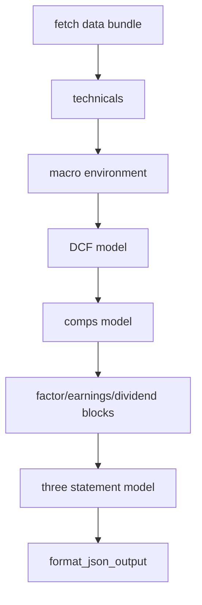

# Financial Modelling Agent

Deterministic valuation engine for DCF/comps/technicals/factor outputs with narrative interpretation layered on top.

## Role

- Computes valuation metrics in Python (not LLM-generated arithmetic).
- Reads structured data from PostgreSQL and peer context from Neo4j.
- Produces orchestration-ready JSON for single or multi-ticker runs.

## Entry Points

From `agents/financial_modelling/agent.py`:

- `run(...)`
- `run_full_analysis(...)`

CLI:

```bash
# direct ticker
python -m agents.financial_modelling.agent --ticker AAPL

# prompt mode (single or multi ticker)
python -m agents.financial_modelling.agent --prompt "Compare MSFT vs AAPL DCF"

# logging
python -m agents.financial_modelling.agent --ticker NVDA --log-level DEBUG
```



## Configuration

Key variables from `agents/financial_modelling/config.py`:

- `FM_LLM_PROVIDER` (default `deepseek`)
- `LLM_MODEL_FINANCIAL_MODELING` (default `deepseek-reasoner`)
- `DEEPSEEK_API_KEY`
- `POSTGRES_*`
- `NEO4J_URI`, `NEO4J_USER`, `NEO4J_PASSWORD`
- `FM_REQUEST_TIMEOUT`, `FM_SQL_TIMEOUT`
- `PRICE_HISTORY_DAYS`, `DCF_FORECAST_YEARS`, `COMPS_SECTOR_PEERS`

## Output

Typical output sections include:

- `valuation` (DCF + comps)
- `technicals`
- `earnings`
- `dividends`
- `factor_scores`
- `three_statement_model`
- `quantitative_summary`

## Notes

- The agent can return a dict (single ticker) or list of dicts (multi ticker prompt).
- CLI output intentionally elides full `price_history`/`benchmark_history` payloads for readability.

## Documentation Metadata

- Last updated: 2026-04-08
- Source of truth: `agents/financial_modelling/agent.py`, `agents/financial_modelling/config.py`
