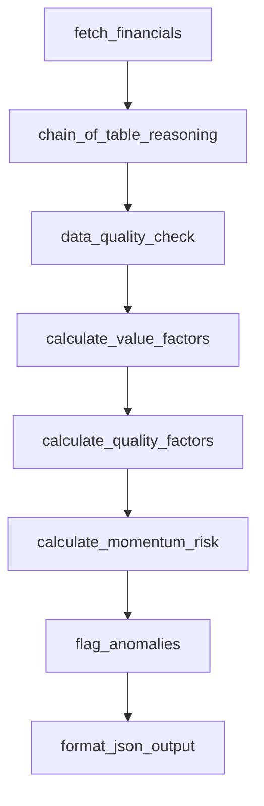

# Quantitative Fundamental Agent

Deterministic factor-analysis agent for valuation-quality-momentum/risk diagnostics using PostgreSQL data.

## Role

- Computes factor outputs in Python (no LLM arithmetic).
- Applies structured chain-of-table reasoning on loaded financial data.
- Returns orchestration-ready JSON with value, quality, momentum/risk, anomaly, and summary fields.

## Pipeline

Current 8-node flow in `agents/quant_fundamental/agent.py`:

1. `fetch_financials`
2. `chain_of_table_reasoning`
3. `data_quality_check`
4. `calculate_value_factors`
5. `calculate_quality_factors`
6. `calculate_momentum_risk`
7. `flag_anomalies`
8. `format_json_output`



## CLI

```bash
# direct ticker
python -m agents.quant_fundamental.agent --ticker AAPL

# prompt mode (single or multi ticker)
python -m agents.quant_fundamental.agent --prompt "Compare MSFT vs AAPL fundamentals"

# log level
python -m agents.quant_fundamental.agent --ticker NVDA --log-level DEBUG
```

Supported CLI args:

- `--ticker` or `--prompt` (mutually exclusive, required)
- `--pretty`
- `--log-level`

## Programmatic API

```python
from agents.quant_fundamental.agent import run, run_full_analysis

single = run(ticker="AAPL")
multi = run(prompt="Compare MSFT vs AAPL fundamentals")

full = run_full_analysis(ticker="NVDA")
```

## Configuration Highlights

From `agents/quant_fundamental/config.py`:

- `LLM_MODEL_QUANT_FUNDAMENTAL` (default `deepseek-chat`)
- `DEEPSEEK_API_KEY`, `DEEPSEEK_BASE_URL`
- `POSTGRES_*`
- `QUANT_LLM_TEMPERATURE`, `QUANT_LLM_MAX_TOKENS`, `QUANT_REQUEST_TIMEOUT`
- `BETA_LOOKBACK_DAYS`, `SHARPE_LOOKBACK_DAYS`
- `ANOMALY_ZSCORE_THRESHOLD`, `ROLLING_MEAN_YEARS`
- `BENEISH_THRESHOLD`, `PIOTROSKI_STRONG_THRESHOLD`, `PIOTROSKI_WEAK_THRESHOLD`

## Notes

- LLM output scope is narrative summarization (`quantitative_summary`) over precomputed metrics.
- Availability profile from orchestration can short-circuit dead data paths.

## Documentation Metadata

- Last updated: 2026-04-08
- Source of truth: `agents/quant_fundamental/agent.py`, `agents/quant_fundamental/config.py`
