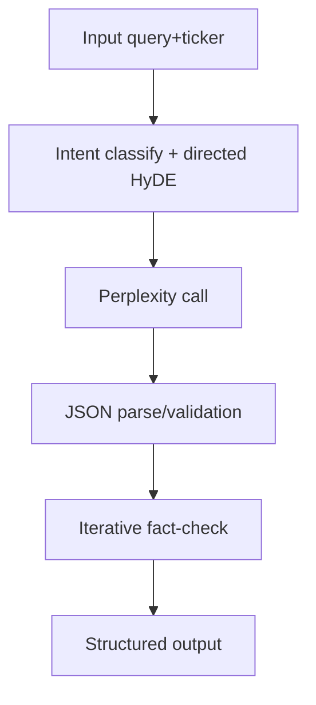

# Web Search Agent

Real-time web intelligence agent for capturing fresh developments that may not yet exist in local data stores.

## Role

- Executes Perplexity-powered web search for breaking and risk-relevant signals.
- Returns structured output for orchestration/summarization.
- Includes directed HyDE prompting and iterative fact-checking logic.

## Entry Points

From `agents/web_search/agent.py`:

- `run_web_search_agent(state)`
- `web_search_node(state)`

## Input/Output Contract

Input keys:

- `query`
- `ticker` (optional)
- `recency_filter` (`day|week|month`, default `week`)
- `model` (default `sonar-pro`)

Output keys include:

- `breaking_news`
- `sentiment_signal`
- `unknown_risk_flags`
- `competitor_signals`
- `supervisor_escalation`
- `confidence`
- `raw_citations`
- `error`
- `fallback_triggered`



## Configuration

Set in environment:

- `PERPLEXITY_API_KEY`
- `WEB_SEARCH_MODEL` (optional default override)
- `WEB_SEARCH_RECENCY_FILTER` (optional default override)

## Behavior Notes

- On API/parse failures, the agent returns degraded structured output with `fallback_triggered=true` and low confidence.
- There is no DuckDuckGo retrieval path in current implementation.
- Supervisor/orchestrator should always check `error` and `confidence` before consuming risk signals.

## Documentation Metadata

- Last updated: 2026-04-08
- Source of truth: `agents/web_search/agent.py`

## Quick Programmatic Example

```python
from agents.web_search.agent import run_web_search_agent

result = run_web_search_agent({
    "query": "NVDA regulatory risk this week",
    "ticker": "NVDA",
    "recency_filter": "week",
    "model": "sonar-pro",
})
print(result)
```
