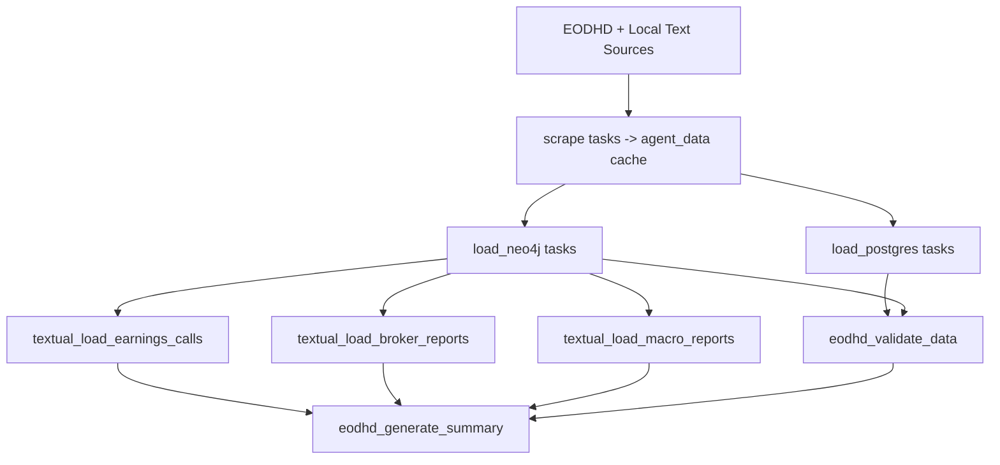

# Ingestion Layer

The ingestion layer is an Airflow-driven ETL pipeline that fetches source data, materializes local caches, and loads PostgreSQL + Neo4j for downstream agent queries.

## Goals

- Keep agent runtime mostly database-local (minimal live upstream dependency at analysis time).
- Maintain repeatable, idempotent loads for structured and textual datasets.
- Provide health-check and validation hooks after ingestion runs.

## Key Components

- DAG: `ingestion/dags/dag_eodhd_ingestion_unified.py`
- ETL loaders:
  - `ingestion/etl/load_postgres.py`
  - `ingestion/etl/load_neo4j.py`
- Text ingestion:
  - `ingestion/etl/ingest_earnings_calls.py`
  - `ingestion/etl/ingest_broker_reports.py`
  - `ingestion/etl/ingest_macro_reports.py`
- Validation utility:
  - `ingestion/etl/inspect_db.py`

## DAG Summary

- DAG ID: `eodhd_complete_ingestion`
- Cron schedule: `0 1 * * *`
- Tickers from `TRACKED_TICKERS`
- Includes:
  - per-ticker scrape/load tasks
  - macro/global load tasks
  - textual ingestion tasks
  - post-load validation and summary

Timezone note: in-source DAG comments label this schedule as HKT. Confirm effective timezone in your Airflow environment configuration.

## End-to-End Flow

1. Fetch API payloads into `ingestion/etl/agent_data/{TICKER}/` and `.../_MACRO/`.
2. Load structured datasets into PostgreSQL.
3. Load graph entities/chunks into Neo4j.
4. Ingest local textual PDFs into chunk stores.
5. Run validation and summary tasks.



## Frequently Used PostgreSQL Tables

- `raw_timeseries`
- `raw_fundamentals`
- `financial_statements`
- `valuation_metrics`
- `sentiment_trends`
- `news_articles`
- `text_chunks`
- `insider_transactions`
- `institutional_holders`
- `earnings_surprises`
- `dividends_history`
- `treasury_rates`
- `market_eod_us`

## Command Reference

### Test selected DAG tasks

```bash
docker exec fyp-airflow-scheduler airflow tasks test eodhd_complete_ingestion eodhd_scrape_AAPL 2026-03-07
docker exec fyp-airflow-scheduler airflow tasks test eodhd_complete_ingestion eodhd_load_postgres_AAPL 2026-03-07
docker exec fyp-airflow-scheduler airflow tasks test eodhd_complete_ingestion eodhd_load_neo4j_AAPL 2026-03-07
```

### Run textual ingestion manually

```bash
docker exec fyp-airflow-webserver python /opt/airflow/ingestion/etl/ingest_earnings_calls.py --all
docker exec fyp-airflow-webserver python /opt/airflow/ingestion/etl/ingest_broker_reports.py --all
docker exec fyp-airflow-webserver python /opt/airflow/ingestion/etl/ingest_macro_reports.py --all
```

### Run health checks

```bash
docker exec fyp-airflow-webserver python /opt/airflow/ingestion/etl/inspect_db.py
```

## Local Textual Source Layout

- Earnings calls: `data/textual data/{TICKER}/earning_call/`
- Broker reports: `data/textual data/{TICKER}/broker/`
- Metadata: `data/textual data/{TICKER}/metadata.json`

## Environment Variables (Core)

- `EODHD_API_KEY`
- `TRACKED_TICKERS`
- `POSTGRES_HOST`, `POSTGRES_PORT`, `POSTGRES_DB`, `POSTGRES_USER`, `POSTGRES_PASSWORD`
- `NEO4J_URI`, `NEO4J_USER`, `NEO4J_PASSWORD`
- `OLLAMA_BASE_URL`
- `EMBEDDING_MODEL`

## Operational Notes

- PostgreSQL/Neo4j loaders are designed for re-runnable upsert-style ingestion.
- Macro data is stored under `_MACRO` and loaded through dedicated macro tasks.
- `inspect_db.py` is the recommended post-run sanity check command.

## Documentation Metadata

- Last updated: 2026-04-08
- Source of truth for DAG tasks/dependencies: `ingestion/dags/dag_eodhd_ingestion_unified.py`
