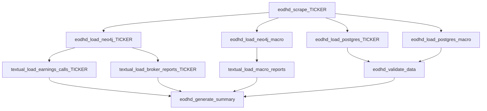

# EODHD Ingestion DAG

Documentation for `ingestion/dags/dag_eodhd_ingestion_unified.py`.

## Overview

- DAG ID: `eodhd_complete_ingestion`
- Schedule cron: `0 1 * * *`
- Tickers: `TRACKED_TICKERS` env var
- Pipeline includes per-ticker scrape/load, macro loads, textual ingestion, and validation.

Timezone note: the DAG source comment labels the cron as HKT in code. Confirm timezone interpretation from your Airflow deployment config when scheduling expectations matter.

## Task Groups (Logical)

For each ticker:

- `eodhd_scrape_{TICKER}`
- `eodhd_load_postgres_{TICKER}`
- `eodhd_load_neo4j_{TICKER}`
- `textual_load_earnings_calls_{TICKER}`
- `textual_load_broker_reports_{TICKER}`

Macro/global tasks:

- `eodhd_load_postgres_macro`
- `eodhd_load_neo4j_macro`
- `textual_load_macro_reports`

Validation/summary:

- `eodhd_validate_data`
- `eodhd_generate_summary`



## Manual Task Testing

```bash
docker exec fyp-airflow-scheduler airflow tasks test eodhd_complete_ingestion eodhd_scrape_AAPL 2026-03-07
docker exec fyp-airflow-scheduler airflow tasks test eodhd_complete_ingestion eodhd_load_postgres_AAPL 2026-03-07
docker exec fyp-airflow-scheduler airflow tasks test eodhd_complete_ingestion eodhd_load_neo4j_AAPL 2026-03-07
docker exec fyp-airflow-scheduler airflow tasks test eodhd_complete_ingestion textual_load_earnings_calls_AAPL 2026-03-07
docker exec fyp-airflow-scheduler airflow tasks test eodhd_complete_ingestion textual_load_broker_reports_AAPL 2026-03-07
```

## Data Outputs (High Level)

- PostgreSQL tables for timeseries, fundamentals, statements, sentiment, news, and macro datasets.
- Neo4j company/chunk graph with vector-indexed chunk retrieval.
- Local `agent_data/` cache under ingestion ETL folder.

## Key Environment Variables

- `TRACKED_TICKERS`
- `EODHD_API_KEY`
- `POSTGRES_*`
- `NEO4J_*`
- `OLLAMA_BASE_URL`

## Documentation Metadata

- Last updated: 2026-04-08
- Source of truth: `ingestion/dags/dag_eodhd_ingestion_unified.py`
