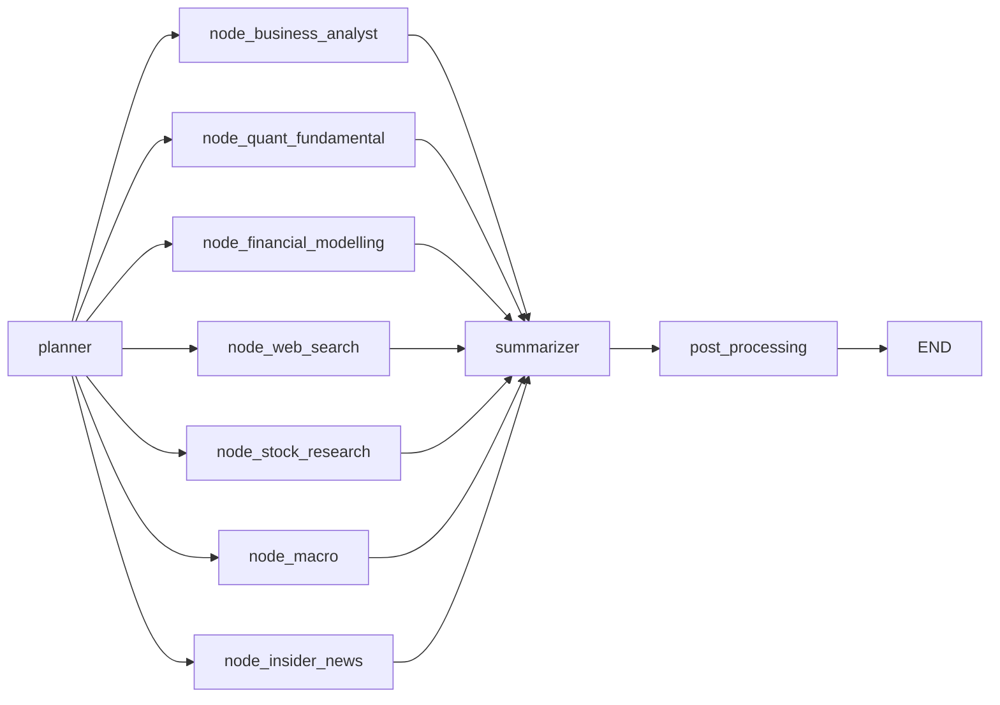

# Orchestration Layer

The orchestration package coordinates planning, parallel agent execution, synthesis, and post-processing in a single LangGraph pipeline.

## Architecture

Current production topology in `orchestration/graph.py`:

```text
planner -> enabled agents (parallel) -> summarizer -> post_processing -> END
```

Possible parallel branches:

- `node_business_analyst`
- `node_quant_fundamental`
- `node_financial_modelling`
- `node_web_search`
- `node_stock_research`
- `node_macro`
- `node_insider_news`

Each branch has per-agent conditional retry routing based on:

- whether output was produced
- branch retry counter in `agent_react_iterations`
- planner-derived retry cap (`react_max_iterations`)



## Package Map

| File | Responsibility |
|---|---|
| `orchestration/graph.py` | Graph build, fan-out/fan-in routing, `run()` and `stream()` |
| `orchestration/nodes.py` | Node implementations (planner, agent nodes, summarizer, post-processing) |
| `orchestration/state.py` | Shared orchestration state schema |
| `orchestration/llm.py` | Planner/summarizer model calls and prompt logic |
| `orchestration/citations.py` | Citation extraction and reference injection |
| `orchestration/data_availability.py` | Backend availability probes and readiness summary |
| `orchestration/feedback.py` | Feedback scoring/storage utilities |
| `orchestration/episodic_memory.py` | Episodic memory lookup and persistence |

## Model Defaults

From `orchestration/llm.py` defaults:

- Planner model: `deepseek-chat`
- Summarizer model: `deepseek-v4-pro`
- Translation model: defaults to summarizer model unless overridden

Primary env vars:

- `ORCHESTRATION_PLANNER_MODEL`
- `ORCHESTRATION_SUMMARIZER_MODEL`
- `ORCHESTRATION_TRANSLATION_MODEL`
- `ORCHESTRATION_LLM_TIMEOUT`
- `ORCHESTRATION_SUMMARIZER_TIMEOUT`
- `DEEPSEEK_API_KEY`

## Public API

Blocking:

```python
from orchestration.graph import run

result = run("Compare MSFT vs AAPL valuation and risks")
print(result["final_summary"])
```

Streaming:

```python
from orchestration.graph import stream

for node_name, payload in stream("Analyze NVDA"):
    print(node_name)
```

Stream behavior:

- First event: `("__session__", {"session_id": ...})`
- Followed by node updates as branches complete.

## Data Availability Integration

Planner-stage checks from `orchestration/data_availability.py` include:

- Neo4j reachability + chunk/index signals
- PostgreSQL reachability + key table/ticker coverage signals
- DeepSeek reachability + model readiness signals

These checks are used for resilient routing and degraded-mode reporting.

## Operational Notes

- Parallel fan-out uses LangGraph native branching (not threadpool wrappers).
- Summarizer handles merged agent payload synthesis.
- Post-processing handles scoring and episodic memory updates.

## Documentation Metadata

- Last updated: 2026-04-08
- Source of truth for graph topology: `orchestration/graph.py`
- Source of truth for runtime nodes/keys: `orchestration/nodes.py`, `orchestration/state.py`
